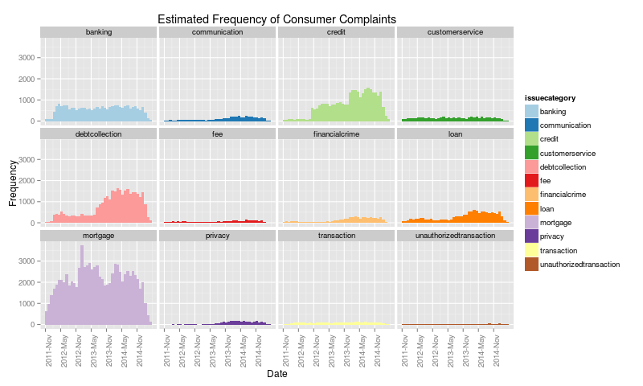
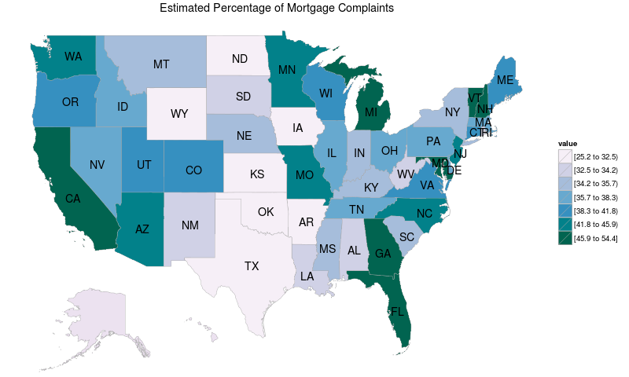
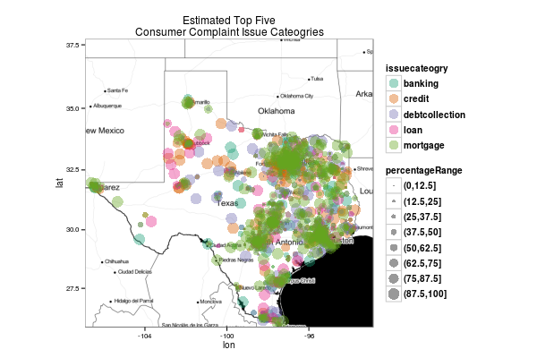
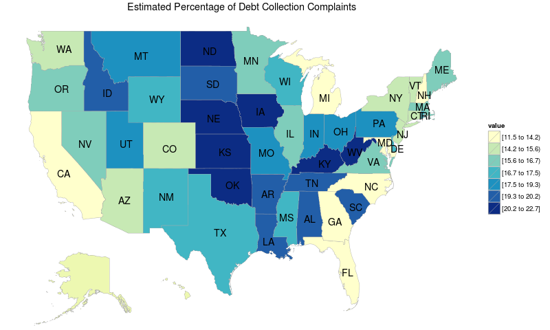
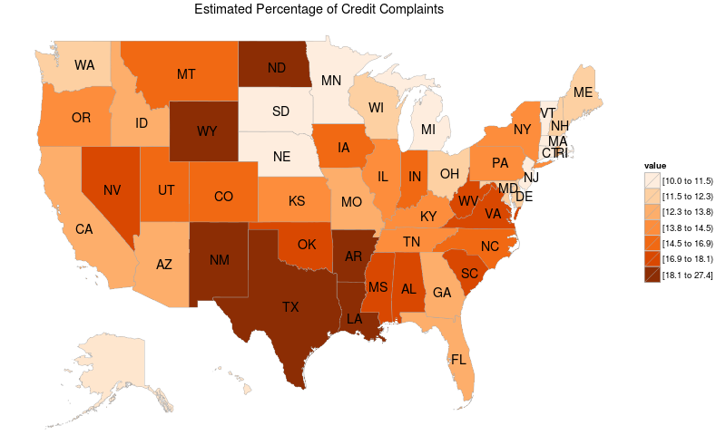
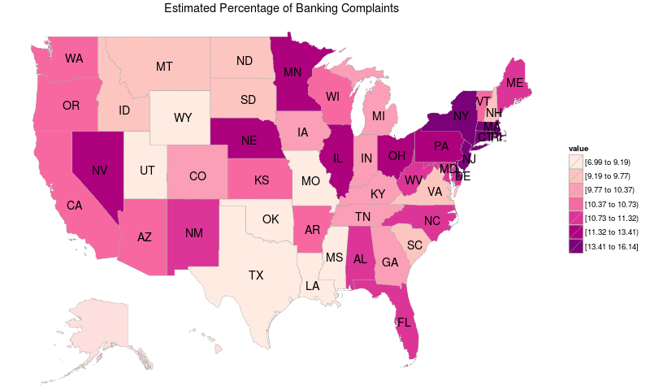
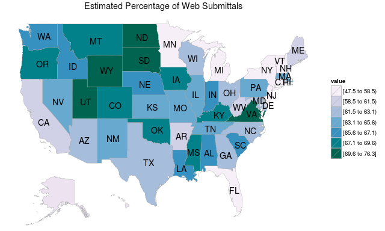

## Introduction
```{r setupEnvironment, echo=FALSE, cache=TRUE, warning=FALSE, message=FALSE}
source("./dataCleaning.R")
source("./dataAnalysis.R")
set.seed(58978160)

dataDirectory <- "./Data"
analyticDataPath <- "./AnalyticData"
maximumPercentMissing <- 10.0

if (is.na(file.info(dataDirectory)[1,"isdir"])) {
    downloadData(dataDirectory)
}

if (is.na(file.info(file.path(analyticDataPath,
                              "/trainingData.csv"))[1,"size"])) {
    createAnalyticDataset(dataDirectory,
                          maximumPercentMissing,
                          analyticDataPath)
}

trainingData <- loadAnalyticData(analyticDataPath,
                                 "trainingData.csv")

validationData <- loadAnalyticData(analyticDataPath,
                                   "validationData.csv")

testData <- loadAnalyticData(analyticDataPath,
                             "testData.csv")

dbDataStatistics <- loadDataStatistics(analyticDataPath)

dbVariables <- initializeVariables(dbDataStatistics)

startDate <- min(trainingData$datereceived)
endDate <- max(trainingData$datereceived)
```
   
- [Consumer Financial Protection Bureau (CFPB)](http://www.consumerfinance.gov/)
[Consumer Complaint Database](https://catalog.data.gov/dataset/consumer-complaint-database)
    * Number of complaints: `r dbDataStatistics$numberobservations`  
    * Number of variables: `r length(dbVariables)`  
    * Number of companies: `r dbDataStatistics$numbercompanies`  
    * Number of unique complaint issues: `r dbDataStatistics$numberissues`
    * Date range: `r startDate` to `r endDate`  
    * Data retrieved from [Data.gov](https://www.data.gov/)  
  
- Topics covered in this presentation
    * [Data cleaning](https://github.com/mspcvsp/ConsumerComplaintDatabase/blob/gh-pages/dataCleaning.R)
    * Visualization of state-level statistics via [chroopleths](https://github.com/trulia/choroplethr)
    * Plotting zipcode-level statistics using the [ggmap package](http://journal.r-project.org/archive/2013-1/kahle-wickham.pdf)

## Data Cleaning
```{r dataCleaning, echo=FALSE}
numCleanObservations <- nrow(trainingData) +
                        nrow(validationData) +
                        nrow(testData)

percentDataRemoved <-
    round(100*(dbDataStatistics$numberobservations - numCleanObservations) / 
          dbDataStatistics$numberobservations,1)
```
- Transform the variable names to lower case  
- Remove '.' from variable names  
- Exclude data from U.S. territories  
- Apply a maximum percent missing threshold to remove partial observations  
- Remove whitespace from the company type  
- For each database variable:  
    * Transform to lower case  
    * Remove punctuation  
    * Replace multiple spaces with a single space  
  
## Data Cleaning (cont.)
- Remove white space from the company type  
- Aggregate the `r dbDataStatistics$numberissues` complaint issues into 
`r length(levels(trainingData$issuecategory))` categories  
- Remove the "other" category  
- Append city, state, latitude, & longitude from the [zipcode R package](https://jeffreybreen.wordpress.com/2011/01/05/cran-zipcode/)  
- Add a companyid variable  
- Convert date variables  
- Convert categorical (i.e. [factor](http://statistics.ats.ucla.edu/stat/r/modules/factor_variables.htm)) variables  
- Percentage of data removed during data cleaning: `r percentDataRemoved`%  

## Percentage of Missing Data
```{r initializePercentMissingTable, echo=FALSE}
percentMissingTableData <- initializePercentMissingDataTable(dbDataStatistics)
```
- Results suggest `r sum(percentMissingTableData[,2] > maximumPercentMissing)`
variables exceed the maximum percentage of missing data threshold of
`r maximumPercentMissing` %.  
  
```{r displayPercentMissingTable, echo=FALSE, results='asis'}
library(xtable)
# Technical references:
# -------------------
# http://stackoverflow.com/questions/20200082/formatting-html-table-in-r
#
# http://stackoverflow.com/questions/21291762/
#   css-how-to-define-a-class-for-table-to-control-the-style-of-table-rows
#
# http://www.w3schools.com/css/css_table.asp
#
# http://cssmenumaker.com/blog/stylish-css-tables-tutorial
#
# http://stackoverflow.com/questions/5430338/
#   remove-data-frame-row-names-when-using-xtable
#
# http://www.granneman.com/webdev/coding/css/centertables/
print(xtable(percentMissingTableData),
      type="html",
      include.rownames=FALSE,
      html.table.attributes="class='table-bordered'")
```

## Frequency of Complaints
- Estimated temporal occurence of consumer complaints  
```{r complaintFrequency, echo=FALSE, fig.width=10, fig.height=5, cache=TRUE}
library(ggplot2)
library(scales)
# http://stackoverflow.com/questions/10770698/
#   understanding-dates-and-plotting-a-histogram-with-ggplot2-in-r
#
# http://stackoverflow.com/questions/1330989/
#   rotating-and-spacing-axis-labels-in-ggplot2
png(filename="./figures/complaintFrequency.png",
    width=800,
    height=480)
g <- ggplot(trainingData, aes(x=datereceived, fill=issuecategory)) +
    geom_histogram(binwidth=30) +
       scale_x_date(labels = date_format("%Y-%b"),
                    breaks = seq(min(trainingData$datereceived)-5,
                                 max(trainingData$datereceived)+5, 180),
                    limits = c(startDate, endDate)) +
       ylab("Frequency") + xlab("Date") +
       facet_wrap(~issuecategory, nrow=3) +
       theme_gray() + theme(axis.text.x=element_text(angle=90, hjust=1)) +
       scale_fill_brewer(palette = "Paired") +
       ggtitle("Estimated Frequency of Consumer Complaints")
print(g)
# http://stackoverflow.com/questions/750703/
#   suppressing-null-device-output-with-r-in-batch-mode
invisible(dev.off())
```

  
## Issue Category Percentage
```{r issueCategoryPercentage, echo=FALSE, results='asis'}
summaryIssueCategoryPercentage <-
    initializeSummaryIssueCategoryPercentage(trainingData)

topFiveIssueCategories <- summaryIssueCategoryPercentage[1:5,
                                                         c("issuecategory")]
```
- Results suggest that `r topFiveIssueCategories[1]`, 
`r topFiveIssueCategories[2]`, `r topFiveIssueCategories[3]`, 
`r topFiveIssueCategories[4]`, & `r topFiveIssueCategories[5]` are the top five
consumer complaint issue categories
  
```{r eda2, echo=FALSE, results='asis'}
print(xtable(summaryIssueCategoryPercentage),
      type="html",
      include.rownames=FALSE,
      html.table.attributes="class='table-bordered'")
```

## Percentage of Mortgage Category Complaints
```{r mortgatePercentage, echo=FALSE, cache=TRUE}
stateIssueCategoryPercentage <-
    computeStateIssueCategoryPercentage(trainingData)

mortgagePercentage <- initializePercentIssue("mortgage",
                                             stateIssueCategoryPercentage,
                                             state.regions)

stateSubmittedViaPercentage <-
    computeStateSubmittedViaPercentage(trainingData)
```
- Estimated percentage of mortgage category consumer complaints for each U.S. state 
[choropleth](http://blog.crisis.net/choropleth-maps-with-d3/)
  
```{r mortgagePercentage, echo=FALSE}
library(choroplethr)
library(choroplethrMaps)
library(ggplot2)
library(RColorBrewer)
# http://cran.r-project.org/web/packages/choroplethr/vignettes/
#   b-state-choropleth.html
png(filename="./figures/mortgagePercentage.png",
    width=800,
    height=480)
choro = StateChoropleth$new(mortgagePercentage)
choro$title <- "Estimated Percentage of Mortgage Complaints"
choro$ggplot_scale = scale_fill_brewer(palette="PuBuGn")
choro$render()
invisible(dev.off())
```


## Percentage of Mortgage Category Complaints  
```{r vizTopFiveTexasIssueCategories, echo=FALSE, message=FALSE, cache=TRUE}
library(ggmap)
if (is.na(file.info(file.path(analyticDataPath,
                              "/texasMapData.RData"))[1,"size"])) {
    texasMap <- get_map("texas",zoom=6,source="stamen",maptype="toner")

    topFiveTexasIssueCategories <-
        estimateTopFiveStateIssueCategories(trainingData, "TX")

    save(texasMap,topFiveTexasIssueCategories,
         file=file.path(analyticDataPath,"/texasMapData.RData"))
}
load(file=file.path(analyticDataPath,"/texasMapData.RData"))

# http://stackoverflow.com/questions/12157291/ggmap-doesnt-show-maps
png(filename="./figures/texasPercentMortgage.png",
    width=600,
    height=400)
print(ggmap(texasMap) + geom_point(aes(x=lon,
                                  y=lat,
                                  colour=issuecateogry,
                                  size=percentageRange),
                                  alpha=0.4,
                                  data=topFiveTexasIssueCategories) +
    scale_color_brewer(palette="Dark2") + 
    guides(colour = guide_legend(override.aes = list(size=5))) +
    theme_bw(base_size = 10) +
    theme(legend.title = element_text(size=10, face="bold")) +
    theme(legend.text = element_text(size = 10, face = "bold")) +
    ggtitle('Estimated Top Five\nConsumer Complaint Issue Cateogries'))
invisible(dev.off())
```


- [D. Kahle and H. Wickham. ggmap: Spatial Visualization with ggplot2. The R Journal,
  5(1), 144-161.](http://journal.r-project.org/archive/2013-1/kahle-wickham.pdf)  
- Map tiles by [Stamen Design](http://stamen.com/), under [CC BY 3.0.](http://creativecommons.org/licenses/by/3.0/) Data by [OpenStreetMap](http://www.openstreetmap.org/), under [ODbL](http://www.openstreetmap.org/copyright).  

## Debt Collection Category Percentage  
- Estimated percentage of debt collection category consumer complaints for each U.S. state  
  
```{r debtCollectionPercentage, echo=FALSE}
png(filename="./figures/debtCollectionPercentage.png",
    width=800,
    height=480)
debtCollectionPercentage <-
    initializePercentIssue("debtcollection",
                           stateIssueCategoryPercentage,
                           state.regions)

choro = StateChoropleth$new(debtCollectionPercentage)
choro$title <- "Estimated Percentage of Debt Collection Complaints"
choro$ggplot_scale = scale_fill_brewer(palette="YlGnBu")
choro$render()
invisible(dev.off())
```


## Credit Category Percentage  
- Estimated percentage of credit category consumer complaints for each U.S. state  
  
```{r creditPercentage, echo=FALSE, cache=TRUE}
png(filename="./figures/creditPercentage.png",
    width=800,
    height=480)
creditPercentage <- initializePercentIssue("credit",
                                           stateIssueCategoryPercentage,
                                           state.regions)

choro = StateChoropleth$new(creditPercentage)
choro$title <- "Estimated Percentage of Credit Complaints"
choro$ggplot_scale = scale_fill_brewer(palette="Oranges")
choro$render()
invisible(dev.off())
```


## Banking Category Percentage
- Estimated percentage of banking category consumer complaints for each U.S. state  
  
```{r bankingPercentage, echo=FALSE, cache=TRUE}
png(filename="./figures/bankingPercentage.png",
    width=800,
    height=480)
bankingPercentage <- initializePercentIssue("banking",
                                            stateIssueCategoryPercentage,
                                            state.regions)

choro = StateChoropleth$new(bankingPercentage)
choro$title <- "Estimated Percentage of Banking Complaints"
choro$ggplot_scale = scale_fill_brewer(palette="RdPu")
choro$render()
invisible(dev.off())
```


## Percentage Submitted Via
- Estimated percent submitted via
```{r percentageSubmittedVia, echo=FALSE, results='asis'}
summaryPercentageSubmittedVia <-
    initializeSummaryPercentSubmittedVia(trainingData)

print(xtable(summaryPercentageSubmittedVia),
      type="html",
      include.rownames=FALSE,
      html.table.attributes="class='table-bordered'")
```
  
- Estimated percentage submitted via the web  
```{r webSubmittedPercentage, echo=FALSE, cache=TRUE}
png(filename="./figures/webSubmittedPercentage.png",
    width=640,
    height=384)
webSubmittedPercentage <-
    initializePercentSubmittedVia("web",
                                  stateSubmittedViaPercentage,
                                  state.regions)

choro = StateChoropleth$new(webSubmittedPercentage)
choro$title <- "Estimated Percentage of Web Submittals"
choro$ggplot_scale = scale_fill_brewer(palette="PuBuGn")
choro$render()
invisible(dev.off())
```

